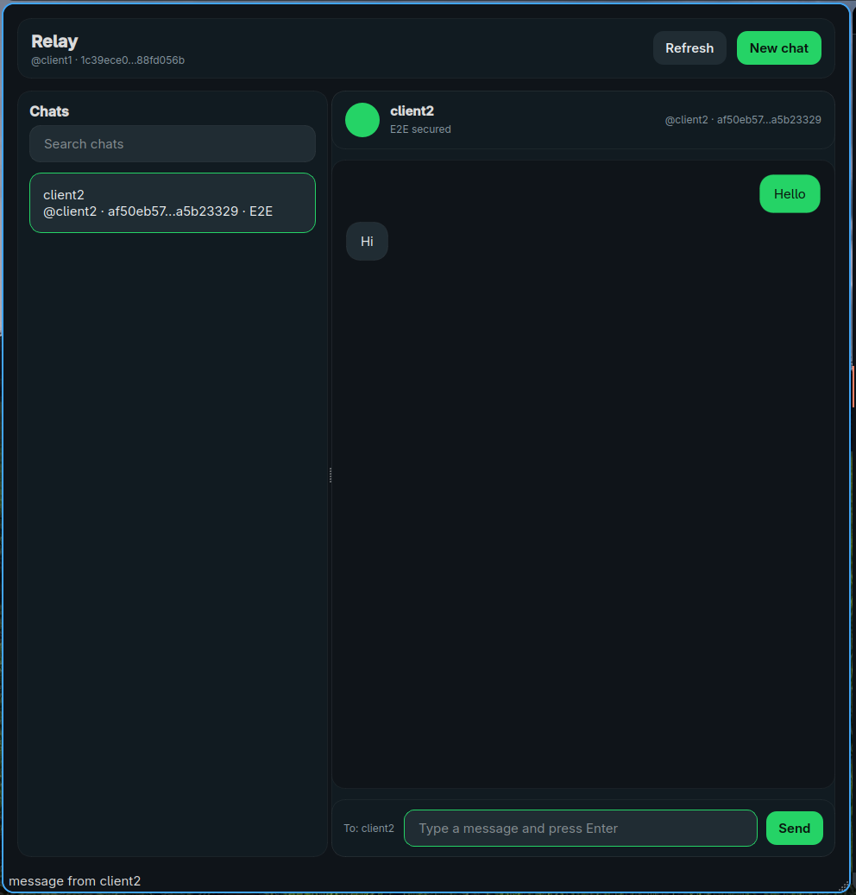

# Relay

Relay is an experimental messenger project written in C/C++.

Its long-term goal is to become a messenger centered on security and simplicity.  
For now, it is an early-stage prototype with incomplete features, protocol, and security model that may change frequently.

## Preview

  

<i>Relay UI (early prototype)</i>

## Security

Relay uses encrypted transport and an experimental end-to-end encryption layer.

Security design is still under active development and has not been audited.

## Contributing

Contributions, testing, and improvements are welcome.

If you want to help:
- open issues for bugs or ideas
- suggest improvements
- submit pull requests

Before contributing, please try to keep the code style consistent.

Please run clang-format before submitting a pull request if available.

## Platform support

- Linux
- Windows

## License
Relay is licensed under the GNU AGPLv3.

See [LICENSE](LICENSE) for details.
